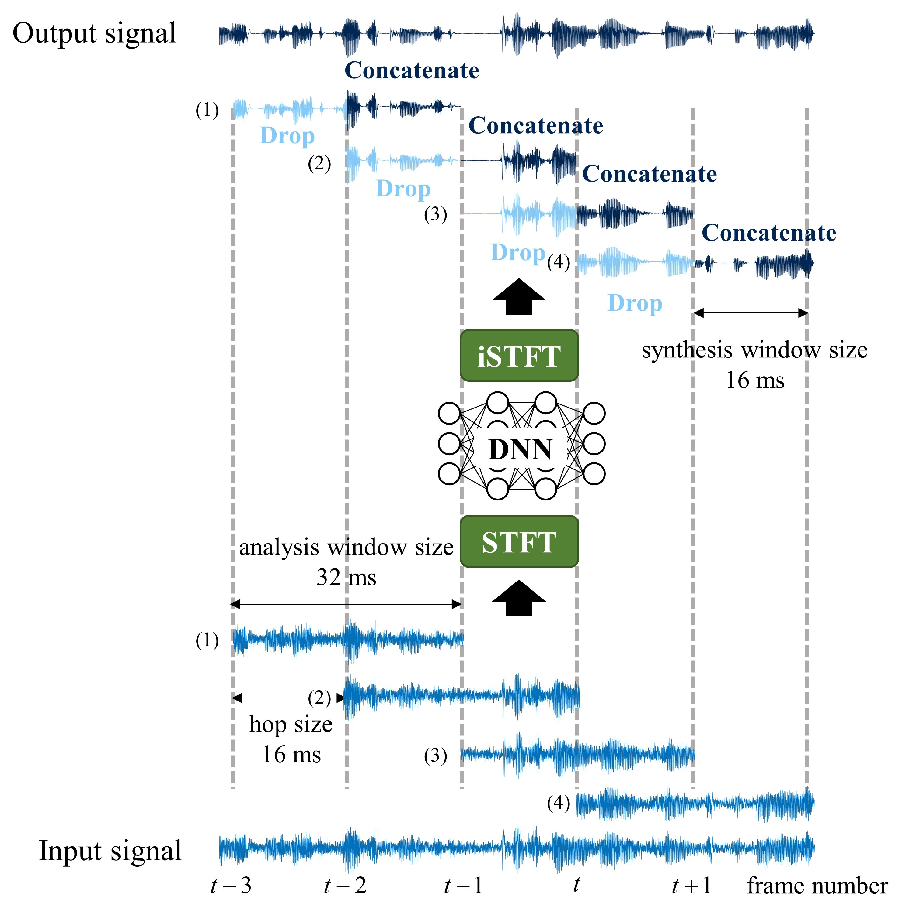

# DeFT-AN-RT: Real-time Multichannel Speech Enhancement using Dense Frequency-Time Attentive Network and Non-overlapping Synthesis Window
Official code of "DeFT-AN RT: Real-time Multichannel Speech Enhancement using Dense Frequency-Time Attentive Network and Non-overlapping Synthesis Window, in Proc. Interspeech, 2023"

In real-time speech enhancement models based on the short-time Fourier transform (STFT), algorithmic latency induced by the STFT window size can induce perceptible delays, leading to reduced immersion in real-time applications. This study proposes an efficient real-time enhancement model based on a dense frequency-time attentive network (DeFT-AN). The vanilla DeFT-AN consists of cascaded dense blocks and time-frequency transformers, which allow for a smooth transition between time frames through a temporal attention mechanism. To inherit this advantage and reduce algorithmic latency, we develop the lightweight and causal version of DeFT-AN with dual-window size processing that utilizes synthesis windows shorter than analysis windows. The benefit of DeFT-AN in identifying temporal context enables the use of non-overlapping synthesis windows, and experimental results show that the model can achieve the highest performance with the lowest algorithmic latency among STFT-based models.

The demo_baseline.wav file in the Example folder corresponds to the FFW with GRU, while the demo_proposed.wav file represents the T-conformer, and demo_clean.wav is the ground truth. When listening to each of these, the baseline exhibits discontinuity in frame intervals due to non-overlapping synthesis windows. On the other hand, the proposed method, leveraging the effective time relationship capturing characteristics of the T-conformer across all previous frames, demonstrates a lack of discontinuity similar to the ground truth.

http://www.sound.kaist.ac.kr
